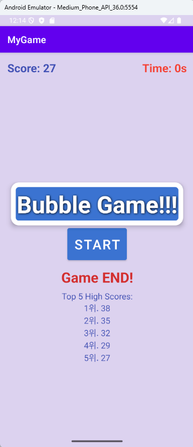

# 안드로이드 버블탭 게임: 캐주얼 게임 개발과 핵심 기술 구현 발표 
안드로이드 플랫폼 위에서 개발한 캐주얼 게임, '버블탭 게임' 프로젝트를 소개해 드리고자 합니다. 이 프로젝트는 단순히 게임을 만드는 것을 넘어, 안드로이드 앱 개발의 주요 컴포넌트 활용과 효율적인 리소스 관리 방법을 탐구하는 데 중점을 두었습니다.

# 1. 프로젝트 개요 및 개발 동기
프로젝트명: 버블탭 게임 (Bubble Tap Game)
목표: 사용자가 쉽고 직관적으로 즐길 수 있는 안드로이드 기반 캐주얼 게임 개발
기술적 동기:
안드로이드의 다양한 UI 컴포넌트(Button, TextView, ConstraintLayout)와 동적인 UI 요소 제어(addView, removeView) 경험.
시간 관리 및 비동기 작업 처리 (Handler, CountDownTimer) 학습.
데이터 영속성을 위한 로컬 저장소(SharedPreferences) 활용 능력 습득.
앱 생명주기에 따른 리소스 관리(onDestroy의 clearBubbles, cancel) 최적화.

# 2. 핵심 기능 및 기술적 구현
저희 버블탭 게임은 30초의 제한 시간 동안 화면에 랜덤으로 생성되는 버블을 최대한 많이 터치하여 점수를 얻는 방식입니다. 각 기능의 기술적 구현을 설명해 드릴게요.
2.1. 동적인 버블 생성 및 제거
구현 기술: Handler, Runnable, Random 클래스
startGame() 메서드 내에서 bubbleRunnable을 Handler에 postDelayed하여 비동기적으로 버블 생성 로직을 반복 실행합니다. [[Ref: handler.postDelayed(this, nextDelay)]]
random.nextInt()를 활용해 버블 생성 개수(1~4개)와 화면 내 무작위 좌표를 결정하여 다이나믹한 게임 환경을 조성했습니다.
생성된 버블(Button 객체)은 gameLayout.addView(bubble)을 통해 런타임에 ConstraintLayout에 추가됩니다.
리소스 관리: 1초 후 handler.postDelayed를 통해 해당 버블을 gameLayout.removeView(bubble)로 자동 제거하여 화면의 혼잡도를 방지하고 메모리 관리를 수행했습니다.

2.2. 버블 터치 이벤트 및 점수 시스템
구현 기술: OnClickListener, UI 스레드 업데이트
생성되는 각 버블(Button)에 setOnClickListener를 부착하여 터치 이벤트를 감지합니다.
버블 터치 시 gameLayout.removeView(bubble)로 해당 버블을 즉시 제거하고 score 변수를 증가시킨 후 updateScore()를 통해 scoreTextView의 점수를 실시간으로 업데이트합니다.

2.3. 게임 타이머 및 상태 관리
구현 기술: CountDownTimer
CountDownTimer를 활용하여 30초의 제한 시간을 설정하고, onTick 콜백에서 매 초 남은 시간을 timeTextView에 업데이트합니다.
onFinish 콜백에서는 게임 종료 로직(버블 제거, 버튼 활성화, 게임 오버 메시지 표시)을 수행하고, 최고 점수 저장 및 표시 기능을 호출하여 게임 흐름을 제어합니다. [[Ref: onFinish()]].

2.4. 최고 점수 (High Score) 저장 및 표시
구현 기술: SharedPreferences
SharedPreferences를 사용하여 게임 종료 시 현재 점수를 로컬 저장소에 영구적으로 저장합니다.
저장된 점수들은 내림차순으로 정렬하여 최대 5개의 최고 점수를 관리하며, highScoresTextView에 보기 좋게 표시합니다. 이를 통해 사용자에게 경쟁 및 재도전 의욕을 불러일으킵니다. [[Ref: saveScore(score), showHighScores()]]

2.5. 안드로이드 앱 생명주기 관리
구현 기술: onDestroy() 콜백
Activity가 소멸될 때 불필요한 리소스(생성된 버블, CountDownTimer)가 누수되지 않도록 onDestroy() 메서드 내에서 clearBubbles()와 countDownTimer.cancel()을 호출하여 안전하게 자원을 해제합니다.

# 3. 개발 환경 및 기술 스택
개발 언어: Java
개발 환경: Android Studio
버전 관리: Git, GitHub
주요 API: android.os.Handler, android.os.CountDownTimer, android.content.SharedPreferences, android.widget.Button, android.widget.TextView, androidx.constraintlayout.widget.ConstraintLayout

# 4. 고민했던 점 및 해결 과정
UI 스레드 처리: 버블 생성 및 제거, 점수/타이머 업데이트는 모두 UI와 관련된 작업이므로, 메인(UI) 스레드에서 처리해야 했습니다. 이를 위해 Handler와 CountDownTimer를 사용하여 UI 블로킹 없이 부드러운 게임 경험을 제공할 수 있었습니다.
동적 객체 관리: 수많은 버블 객체가 생성되고 소멸되는 과정에서 발생하는 메모리 누수를 방지하기 위해, onDestroy() 시점에 모든 Runnable과 CountDownTimer를 명확히 removeCallbacks 및 cancel 처리했습니다. [[Ref: clearBubbles()]]
디바이스 호환성: dpToPx()와 같은 단위를 활용하여 다양한 안드로이드 디바이스의 화면 밀도(DPI)에 관계없이 버블 크기가 일관되게 보이도록 구현했습니다.

# 5. 성과 및 향후 개선 방향
성과:
안드로이드 앱의 기본 구조 이해 및 실제 구현 능력 향상.
비동기 처리, UI 동적 제어, 데이터 영속성 관리 등 핵심 기술 스택 경험.
작은 규모의 프로젝트를 처음부터 끝까지 완성하는 과정 학습.
향후 개선 방향:
다양한 종류의 버블 추가 (크기, 속도, 특수 효과).
게임 난이도 조절 기능 (시간 단축, 버블 생성 속도 증가).
사운드 효과 및 배경 음악 추가로 몰입도 향상.
멀티 터치 최적화.

# 6. 결론
버블탭 게임 프로젝트는 저에게 안드로이드 앱 개발에 대한 깊이 있는 이해와 실질적인 경험을 제공해 주었습니다. 짧은 시간 안에 핵심적인 기능을 구현하며 발생할 수 있는 문제점들을 해결해나가는 과정은 매우 값진 학습 경험이었습니다.

# 설치 및 실행 방법
저장소 클론:
git clone [[BubbleTapGame](https://github.com/MaINoo999/ON-Device_Object-Oriented-Programming/tree/db9c74758c530a6808468430c8976d908bf60657/BubbleTapGame)]
안드로이드 스튜디오에서 열기:
Android Studio를 열고, 'Open an existing Android Studio project'를 선택한 후 클론한 프로젝트 폴더를 엽니다.
빌드 및 실행:
프로젝트가 성공적으로 빌드되면, 에뮬레이터 또는 실제 안드로이드 기기에서 앱을 실행해 보세요.
